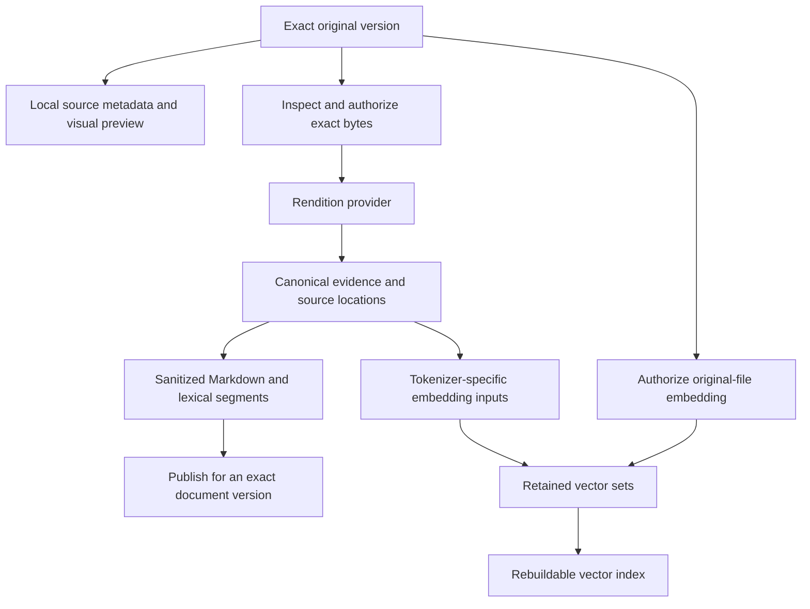

# Document Processing

Docbank keeps original document versions and the results derived from them
separately. A new extractor or embedding model can produce a new result without
rewriting the original. Search uses only results that the vault has explicitly
published for the relevant document version.

This page describes the implemented Go contracts and internal processing
architecture. For an application choosing extractors or embedding providers,
start with [Document Understanding in Go](../document-understanding.md).

## Which interfaces expose this work?

| Interface | Current scope |
|-----------|---------------|
| Public `document/*` Go packages | Evidence, rendition, OCR, upload, embedding, and provider contracts; the importing application owns orchestration and persistence |
| Public embedded vault API | Plan and run processing, read retained renditions and coverage, and search exact source versions in lexical, semantic, or hybrid mode; also process local metadata and read visual previews; see [Embed in Go](../embedding.md) |
| Daemon background jobs | Local metadata, checksum, and visual-preview work; configured rendition and embedding jobs; vector-index rebuilding |
| Internal processing and storage packages | Profiles, consent, publication, retention, and derivative purge |
| Internal retrieval packages | Lexical, semantic, and hybrid retrieval; optional expansion and reranking; QMD export and query adapters |
| CLI and HTTP | Preview and run profiles, inspect jobs, read retained renditions, and search an explicit source-version fence |
| Web app and TUI | Preview processing, record consent, inspect jobs, and read retained sanitized renditions |

The default configuration has no processing profiles. The daemon can execute
its built-in plaintext and EPUB rendition adapters and the OpenAI-compatible
and Voyage embedding runtimes listed in [Configuration][embedding-runtime].
Other public provider packages are available to embedded Go callers; adding a
package does not register a daemon runtime. Configuration alone does not grant
consent or enqueue work.

[embedding-runtime]: ../configuration.md#embedding-workers-and-credentials

`configureRenditionProviders` selects `document/epub` for `epub.in-process/v1`
and passes the existing byte and unit limits to its constructor. The provider
owns the `epub.in-process-v1` descriptor and virtual-unit policy. Startup
rejects descriptor or trust-boundary drift; unknown adapters remain
unavailable. Marker advertises no EPUB capability and rejects EPUB upload
metadata before egress. Its other formats retain their staging and fallback
behavior.

[Document processing](../usage/document-processing.md) follows the operator
workflow from profile selection through preview, consent, execution, and reads.
[Processing search](../usage/search.md) explains lexical, semantic, hybrid, and
auto modes with an explicit profile and authorized source-version fence.
Ordinary name and text search remains separate.

## From original bytes to searchable evidence

Canonical evidence records what the extractor found and where it came from.
It includes ordered units, source locators, regions, headings, artifacts, and
explicit omissions. A partial or degraded result retains that status instead
of claiming complete document coverage. Timed transcript units retain optional
speaker identity and half-open millisecond spans. Untimed supplied transcripts
follow the same contract without invented timestamps or speaker identities.

A rendition contains sanitized Markdown and model-independent text segments
for keyword search. Embedding input generation reads canonical evidence, not
the retained Markdown wrapper. It applies a named tokenizer, chunk policy,
and document-role formatter. This keeps navigation metadata and frontmatter
out of embedding text. Direct-file embeddings use separately authorized
original bytes instead of a rendition.

Local [source metadata](source-metadata.md) and
[visual previews](visual-previews.md) have their own processors and version
identities. They do not require a hosted rendition provider.

## Keep policy and result identities separate

A processing profile is an immutable description of extraction, text handling,
embedding inputs, retention, disclosure, and retrieval limits. Its fingerprint
is a checksum of that declared policy. Credentials are named bindings; their
secret values are not retained in the profile.

Docbank also computes separate fingerprints for the rendition request,
evidence and lexical policy, each embedding-input policy, each vector space,
and retention and disclosure. This permits reuse at the layer whose inputs
still match. Changing embedding chunking does not redefine the original or
make a different extractor result equivalent.

A vector space defines which vectors can be compared: provider descriptor,
model, dimensions, metric, normalization, scalar encoding, and input
formatters all matter. Destination-sensitive disclosure identities are checked
separately. Matching dimensions alone do not establish compatibility.

The [profile contract](https://github.com/kenn-io/docbank/blob/main/document/profile.go)
owns these identities. The [embedding contract](https://github.com/kenn-io/docbank/blob/main/document/embedding.go)
owns provider requests and compatibility checks.

## Authorize disclosure before provider work

Inspection binds the operation to the exact source hash, byte count, detected
format, and locally measured limits. The upload layer stages those bytes and
issues a one-shot authorized reader. Provider adapters receive that reader,
not arbitrary access to the vault. The outbound transport checks the declared
origin and allowed network ranges when establishing the actual connection.

Before granting consent, the caller reviews each flow's runtime disclosure:
immediate and ultimate processor, endpoint, deployment, model and revision,
vector space, provider-visible metadata, and retained artifact roles. The plan
fingerprint seals those values alongside the exact source and portable profile.
Embedded callers supply endpoint disclosures for network providers when opening
the vault; [Embed in Go](../embedding.md#configure-document-processing) describes
the configuration contract.

A durable consent grant records the principal, scope, processing-profile and
disclosure fingerprints, permitted input classes, retained artifact classes,
and optional expiry. A worker checks the grant before provider egress and
holds a fence against revocation while the call runs. Publication checks its
authority again. A replacement grant does not revive work whose original
grant was revoked.

Restoring a vault starts a new processing incarnation: a new local identity
for provider authority. The restored history still explains previous consent,
but those old grants do not authorize new outbound requests.

These rules are implemented in the
[consent catalog](https://github.com/kenn-io/docbank/blob/main/internal/store/consent.go),
[upload package](https://github.com/kenn-io/docbank/tree/main/document/upload),
and [provider transport](https://github.com/kenn-io/docbank/tree/main/document/providerhttp).
Provider capability manifests and a vault's human-consent records serve
different purposes; neither substitutes for the other.

## Publish complete results for exact versions

The rendition catalog separates an immutable build from the attachment that
allows one content version to use it. Several attachments can reuse a build
inside the vault. An active head selects the attachment visible for an exact
content-version and processing-profile pair.

Workers retain attempts, leases, and provider-operation state separately from
completed builds. A resumable provider can continue polling a recorded
operation without reopening source bytes. If a submission outcome is ambiguous,
the worker resumes a known operation or requires operator action instead of
automatically uploading the source again. A late or stale worker
cannot publish over newer authority. Rendition attachment and lexical serving
generation changes publish together.

Embedding inputs, vector sets, and version-specific embedding sets are also
immutable records. Each embedding binding has its own active head, so an
optional failed binding does not replace another binding's successful result.
Vector values live in validated blob artifacts; SQLite records their identity
and membership. The vector-index worker builds disposable generations from
those retained sets and publishes only against the source membership it read.
Reader leases keep a selected generation available during a query.

Coverage reads source visibility, serving heads, and replacement jobs in one
catalog snapshot. A replacement counts as `rebuilding`; the separate
`previous_generation_serving` count records whether a complete prior result
remains available. Those documents are not also counted as `complete`. Embedding
coverage uses the same current attachment and evidence checks as search. A
missing required result keeps aggregate coverage `partial` even if other work
is rebuilding. See the [HTTP coverage contract](http-api.md#coverage-and-source-fenced-search).

The owning implementations are the
[rendition worker](https://github.com/kenn-io/docbank/blob/main/internal/processing/rendition_worker.go),
[rendition catalog](https://github.com/kenn-io/docbank/blob/main/internal/store/processing_catalog.go),
[embedding catalog](https://github.com/kenn-io/docbank/blob/main/internal/store/embedding_catalog.go),
and [vector-index catalog](https://github.com/kenn-io/docbank/blob/main/internal/store/vector_index.go).

## Explain retrieval without granting authority to a provider

The internal searcher treats omitted and `auto` modes as lexical. Explicit
semantic and hybrid modes require compatible active vector authority and a
query encoder. The source-version fence selects eligible vectors from current, live
attachments before scoring. Missing vector-row authority stops the search. Results
retain source references, lexical and semantic rank contributions, coverage,
truncation, and degradation information. Candidates are checked against current
vault authority before they are passed to optional reranking.

For a timed rendition segment, lexical evidence resolves the exact lexical
segment to its build unit. Rendition-chunk semantic evidence resolves the exact
input generation and source unit from retained canonical artifacts. Both paths
return the same optional `time_span` shape and the exact build identity.
Direct-file embeddings and untimed evidence omit `time_span`; zero is a valid
segment start and remains present in JSON. Hybrid results retain each lane's
separate evidence reference instead of combining disjoint spans. The daemon HTTP
API preserves these spans for CLI and web clients.

The processing service caches verified timing mappings for up to 100,000 inputs.
A cold lookup still reads the retained generation and evidence artifacts. If an
artifact cannot be read or verified, search omits the affected semantic hit and
marks the report `truncated`; other documents remain available.

Query expansion produces bounded alternate queries. Reranking reorders an
already authorized candidate list from bounded excerpts and evidence
references. Each stage requires its own authorization, deadline, and explicit
choice to fail the query or return degraded results. Its receipt records the
outcome and counts without retaining query or excerpt text.

QMD is an operator-hosted document-search service. Docbank supplies an export
and query adapter for it alongside the internal reranking adapters below.

| Internal adapter | Purpose |
|------------------|---------|
| [`internal/retrieval/cohere`](https://github.com/kenn-io/docbank/tree/main/internal/retrieval/cohere) | Hosted `rerank-v4.0-pro` or `rerank-v4.0-fast` |
| [`internal/retrieval/zeroentropy`](https://github.com/kenn-io/docbank/tree/main/internal/retrieval/zeroentropy) | Hosted `zerank-2` reranking |
| [`internal/qmdexport`](https://github.com/kenn-io/docbank/tree/main/internal/qmdexport) | Export active sanitized Markdown as disposable QMD collections |
| [`internal/retrieval/qmdbridge`](https://github.com/kenn-io/docbank/tree/main/internal/retrieval/qmdbridge) | Query an operator-hosted QMD endpoint and resolve results through Docbank authority |

A QMD export contains verified Markdown and a manifest mapping QMD URIs back
to exact Docbank versions and rendition artifacts. Publication selects a whole
immutable collection generation. The query adapter holds consent through the
request, checks the selected generation, and resolves returned candidates
against the current vault and requested scope. QMD's index does not become the
source of document ownership or current-version truth.

Similar-document retrieval scores every stored source row against the fenced
candidate rows. Cosine and dot product keep the greatest score; L2 keeps the
smallest distance and returns its negative. The store preserves every document
membership when several documents share a vector-set row. It deduplicates only
the scoring inputs, then expands matches before excluding the source node and
grouping by content hash. For example, two eligible copies of a result appear
as one row with `duplicate_count: 1`.

Current/live eligibility, binding authority, and vector-index leases apply to
both source and candidates. The final transaction rechecks source identity and
the source manifest. Missing source coverage returns an unavailable report;
it never invokes an encoder or provider. Ordinary processing search keeps its
existing document results. See the [HTTP contract](http-api.md#similar-documents).

The [searcher](https://github.com/kenn-io/docbank/blob/main/internal/retrieval/search.go)
and [optional provider stages](https://github.com/kenn-io/docbank/blob/main/internal/retrieval/providers.go)
own the detailed retrieval contract. These packages are internal integration
primitives, not public Go imports or CLI recipes.

## Retain, restore, or remove derived results

A processing profile declares whether to retain provider Markdown, sanitized
Markdown, and typed artifacts. Retained evidence, renditions, embedding-input
generations, and vector sets are cataloged against verified blobs. Original
content versions remain separate authority.

Backups include the retained derivative catalog and the blobs it authorizes.
Restore validates them and rebuilds lexical and vector indexes from retained
local data; it does not rerun extraction or call embedding providers. See
[Backup architecture](backup.md) for the snapshot and restore boundary.

The internal derivative-purge operation removes selected serving attachments
and collects complete builds or generations only when no remaining root needs
them. Shared attachments, active workers and readers, and backup pins can
retain a result. A durable suppression prevents background discovery from
silently recreating an explicitly purged result; rebuilding requires an
explicit authorization that supersedes that suppression.

Derivative purge preserves original versions and does not erase copies in
existing backup repositories. Removing a source version first revokes its
derived serving authority, then leaves shared-result collection to the same
retention rules. The [garbage collector](https://github.com/kenn-io/docbank/blob/main/internal/store/gc.go)
and [purge suppressions](https://github.com/kenn-io/docbank/blob/main/internal/store/derivative_suppression.go)
own these rules.

The [Document derivatives](document-derivatives.md) reference describes the
sanitized Markdown envelope, body-relative navigation, and consumer source
identity contract.
