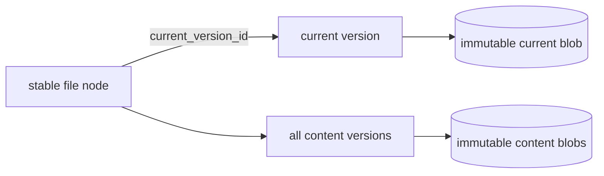

# Editing and versions

Every file enters Docbank with a stable content-version identity. The file node
is document identity; the version identifies one immutable set of bytes. Users
and agents can list versions, inspect one by UUID, and retrieve its bytes even
after the node moves or is renamed.

Content replacement is implemented by `docbank put`, and reversion by
`docbank revert`. Both add immutable history instead of rewriting an existing
version. Interactive editing remains planned on top of the same write contract.

## Version contract

Initial ingest and remote upload create an immutable `content_create` record in
the same SQLite transaction as the file node. The record carries:

- a random, canonical UUIDv4 `version_id` that is never allocator-derived;
- the stable node ID and node revision that introduced it;
- SHA-256, byte length, and media type for the immutable blob;
- a canonical UTC recording time; and
- a separate random operation UUID and transition kind.

The node's `current_version_id` points to a version belonging to that same node.
SQLite enforces the cross-reference, one version per node revision, and one
version per node/operation pair. Two files containing identical bytes share one
blob but still receive distinct version and operation identities.

Moves, renames, trash, and restore change node metadata and revisions without
creating content versions. An idempotent re-import that skips an existing file
also creates no version.

## Read surfaces

```bash
docbank versions /taxes/2025/return.pdf
docbank version <version-id> --json
docbank version <version-id> --content > return.pdf
```

`versions` is newest-first and bounded by `--limit` and `--offset`; `--json`
returns the complete page envelope including `total`. `version` addresses
metadata or bytes by UUID, independent of the node's current path.

The HTTP equivalents are:

- `GET /api/v1/nodes/{id}/versions?limit=&offset=`;
- `GET /api/v1/versions/{version_id}`; and
- `GET /api/v1/versions/{version_id}/content`.

Current-node and ID-addressed version streams both send
`X-Docbank-Content-Version`, `X-Docbank-Blob-Hash`, and
`X-Docbank-Blob-Size` before the body, then a computed `Content-Digest` trailer
after successful EOF. A client must still hash privately staged bytes and
compare the trailer before publishing them.

## Retention and backup

Every content-version row is a GC reachability root, whether or not it is the
current head. Deleting a file's tree metadata through trash empty removes its
versions; only then can unreferenced blobs become GC candidates. Repack may
change physical placement but not version identity.

Deterministic metadata JSONL includes every version and every node's current
pointer. Backup capture, verification, and restore therefore preserve stable
version IDs across loose or packed physical representations. Import rejects
dangling current pointers, cross-node pointers, size disagreement, invalid UUIDs,
and malformed JSON records transactionally.

## Replacing content

```bash
docbank put revised.pdf /taxes/2025/return.pdf
```

`put` opens a regular source without following a final symlink, detects or
accepts its media type, and hashes it before starting or contacting the daemon.
It then inspects the target and uploads with that node revision. Keeping the
local pass outside the daemon lifecycle avoids idle shutdown during a slow read
and shortens the optimistic-concurrency window. Hashing and upload have separate
progress stages because the daemon requires the expected SHA-256 and size before
granting authority. The client uses `Expect: 100-continue`, allowing the daemon
to reject a stale or invalid target before the large body is transmitted.

The corresponding `PUT /api/v1/nodes/{id}/content` body is the raw file bytes.
It requires `If-Match`, `X-Docbank-Blob-Hash`, and
`X-Docbank-Blob-Size`; `Content-Type` becomes version metadata. The daemon
durably writes and independently hashes the body first. Only an exact match
allows one transaction to create the `content_replace` record, advance
`current_version_id`, update metadata, and bump the node revision. The response
returns the new node and version plus the computed identity and resulting ETag.

A stale revision fails with `412`; a size or digest mismatch fails with `422`.
Neither grants new metadata or blob authority. A crash or rejection after the
durable write may leave an authority-free loose object for ordinary GC. The old
head remains readable throughout. Even a replacement with identical bytes
creates a distinct version and operation while content storage deduplicates the
shared blob.

## Reverting content

```bash
docbank revert /taxes/2025/return.pdf <prior-version-id>
```

Reversion is a metadata-only content transition. The selected version must
belong to the target file and must not already be its current head. Under the
target's inspected revision, one transaction creates a new `content_revert`
version with the source's exact blob hash, size, and media type; records the
source version ID; advances `current_version_id`; and bumps the node revision.
No loose or packed bytes are read, copied, or rewritten.

The source and every intervening version remain immutable and addressable. A
later repeat of the same historical choice creates another explicit revert
operation rather than reusing the earlier history row. Because no content is
destroyed, reversion needs no destructive confirmation. A stale node fails with
`412`; a source from another node and an already-current source fail with
structured `422` errors.

`POST /api/v1/nodes/{id}/revert` accepts `source_version_id` with `If-Match`.
Its receipt returns the resulting node, the new reversion row, the complete
source version, and the resulting ETag. Clients accept success only when all
node, revision, source, and content-authority fields agree.

## Planned editing and retention

!!! info "Planned — Phase 2b"
    Interactive `edit` will use private staging and the implemented replacement
    transaction. It must require optimistic concurrency rather than overwriting
    another actor's head.

    Version pruning is explicit and releases blob reachability only when its
    metadata row is removed. No automatic retention policy is the default. A
    version protected by a [full-audit scope](audited-history.md) is never
    eligible for ordinary pruning.



## Why blobs will not be edited in place

In-place mutation would break the defining guarantees simultaneously: the
object name would stop matching its SHA-256, duplicate references would observe
unexpected changes, a partial write could tear content, and the previous bytes
would be lost. Keeping the byte layer append-only makes transactional pointer
replacement the only compatible editing model.
