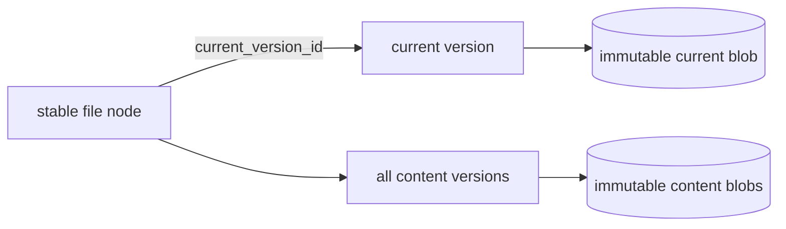

# Editing and versions

Docbank does not currently expose content replacement, version listing, or
version retrieval. A file node points at the blob imported with it; users can
rename, move, trash, and restore that node without changing its bytes.

## Implemented foundation

The schema includes `node_versions(node_id, blob_hash, size, replaced_at)`, and
GC treats rows in that table as reachability roots. This reserves a safe place
for prior immutable contents, but no current command or API route writes or
reads version rows. The reserved shape is not yet a public contract and will be
evolved before the first writer so versions have stable identity and can
participate in [audited history](audited-history.md).

The storage invariant already applies: a canonical blob is immutable. Any
content-replacement feature must publish a new durable blob and change metadata
transactionally; it cannot edit bytes in place without invalidating their hash.

## Planned model and surfaces

!!! info "Planned — Phase 2b"
    A document node will remain the stable identity while its content pointer
    changes. Replacing content will:

    1. hash and durably publish the new bytes;
    2. create a stable content-version record for the new head, including its
       blob hash, size, media type, and resulting node revision; and
    3. point the node at that version, update metadata, and bump its revision in
       the same SQLite transaction. The previous version record remains
       unchanged.

    Initial ingest likewise creates a stable first version and makes it the
    node's current version. Reversion creates another new head/version identity
    that may reference an older blob. Every current or historical head is
    therefore addressable before it is ever displaced.

    Version identities are opaque UUIDv4 values generated from the operating
    system's cryptographic random source, stored in canonical lowercase form,
    and protected by a unique constraint with collision retry. They are not
    sequential and are never derived from node IDs, content hashes, or clocks.
    Pruning an unaudited version therefore cannot make its identity available
    for reuse; deterministic JSONL preserves each retained UUID verbatim and
    rejects malformed or duplicate values during import.

    A metadata transaction may create at most one version for a node. Every
    native version records the immutable operation ID that introduced it, with a
    unique `(node_id, introduced_operation_id)` constraint. This binds one new
    head to one create, replace, or revert intent even when audited event fan-out
    repeats that transition across overlapping scopes.

    Existing vaults require a one-time bootstrap before the daemon advertises
    editing or audit support. In one daemon-exclusive metadata transaction,
    Docbank creates a stable initial version for every file that still points
    directly at a blob, assigns the node's `current_version_id`, and creates the
    stable vault ID used by future audit hashes. It also migrates every retained
    legacy `node_versions` row into a historical content-version record. Before
    conversion it requires the referenced node to be a file, the referenced
    blob to exist, the size to equal blob authority, and `replaced_at` to be a
    canonical UTC timestamp. Failure of any check aborts the complete bootstrap.

    Legacy version rows have no identity, media type, or introducing node
    revision. Bootstrap sorts them by `(node_id, replaced_at, blob_hash, size)`,
    collapses only exact duplicate tuples, and records that collapsed count in
    its report. It assigns a fresh, non-reusable UUIDv4 to every remaining row,
    preserves `replaced_at` as `recorded_at`, and represents the unavailable
    media type and node revision as absent. Each receives the frozen
    `version_origin` value `legacy_v1`. Distinct timestamps remain distinct
    versions even when they reference the same blob, and a historical row equal
    to the node's current content remains separate from the newly created
    current version. The current version is explicitly a `legacy_v1` baseline:
    it preserves the current hash, size, media type, and node revision and uses
    the observed bootstrap time, but does not invent an original
    content-introduction time that the old schema never recorded. Every version
    created natively by v2 carries `version_origin: native` and must record its
    introducing node revision and operation ID. Migrated `legacy_v1` records
    require the operation ID absent because v1 never recorded it. Import rejects
    invalid revision/operation-ID presence or any unknown origin token.

    Bootstrap also assigns canonical, non-reusable UUIDv4 identities to every
    retained legacy tag and ingest record; any existing integer IDs remain
    internal implementation keys rather than portable identities. It
    canonicalizes legacy provenance and deterministically collapses identical
    duplicate facts before deriving their v2 identities; distinct facts remain
    intact and the bootstrap report records the collapsed count. A failure
    rolls the whole bootstrap back, and no editing or audit endpoint is
    available until every file has a current version identity and the vault ID
    plus every portable tag and ingest identity is durable. Deterministic JSONL
    export/import preserves those assigned IDs after the cutover.

    A v1 JSONL import first validates and materializes its records into private
    v1 staging, then runs this exact bootstrap before the restored store can be
    published or opened. It does not translate rows piecemeal while decoding or
    expose an intermediate store. Compatibility fixtures cover both direct v1
    databases and v1 JSONL imports, including duplicate and same-blob historical
    rows, absent legacy fields, invalid references, retained GC roots, and the
    resulting v2 export/import round trip.

    Bootstrap switches the vault's portable authority to
    `docbank-metadata-jsonl-v2`, even when it has no audit scope. This
    **zero-scope v2** form carries the stable vault ID, node-ID allocator
    high-water mark, content-version records, node `current_version_id`
    references, and stable tag, ingest, and provenance identities without audit
    genesis, lineage, scopes, or chains. Format v1 is
    valid only for a pre-bootstrap vault because it cannot represent those
    identities. Enabling the first audit scope later creates audit genesis from
    the existing v2 projection; import and restore never synthesize audit
    authority for a zero-scope stream.

    Bootstrap also permanently raises the live-store feature level through a
    crash-safe, daemon-exclusive cutover. Before beginning or committing any v2
    metadata transaction, Docbank publishes a non-ignorable
    `bootstrap_pending` store/layout generation and syncs both it and its parent
    directory. Every supported pre-bootstrap binary fails store open on that
    generation. Only then may the new daemon create portable identities in one
    SQLite transaction. After commit it reopens a pinned read snapshot, verifies
    every v2 bootstrap invariant, atomically publishes `v2_ready`, and syncs the
    generation again before exposing editing, export, backup, or restore.

    A crash before the pending generation is durable leaves no v2 authority. A
    crash after it is durable leaves legacy access blocked. On the next open, a
    v2-aware binary takes the exclusive vault lock and examines the database:
    a rolled-back pre-bootstrap database resumes the idempotent bootstrap from
    the beginning, while a committed complete v2 database is fully reverified
    before the fence advances to `v2_ready`. An incomplete or contradictory
    state is a hard recovery error and never serves data. No path clears the
    pending fence merely to regain legacy access.

    The fenced layout is outside legacy overwrite-restore cleanup and
    publication paths; restoring a v1 snapshot may target a fresh directory but
    cannot replace a pending or ready v2 vault. Release compatibility tests
    exercise both fence states and every crash boundary, then attempt store open
    and overwrite restore with each supported pre-bootstrap binary and require
    refusal with no file or metadata change. Enabling full audit later advances
    the fence again to the stricter audit-aware level described in
    [Audited History](audited-history.md).

    Versions will be whole-content snapshots, not diffs. Identical bytes will
    still deduplicate, and a crash before the metadata transaction commits will
    leave the old head intact with at most an orphan blob for GC.

    Planned CLI surfaces are `versions`, `put`, `revert`, and `edit`. Planned
    HTTP surfaces are `PUT /nodes/{id}/content`,
    `GET /nodes/{id}/versions`, and version-content retrieval. ID-addressed
    replacement will require `If-Match` so concurrent edits fail with 412
    rather than losing an update.

    Reverting will create a new head from old content rather than erase later
    history. Version pruning will be explicit and will release blob
    reachability only when its metadata row is removed. No automatic retention
    policy is planned as a default. A version protected by a
    [full-audit scope](audited-history.md) is never eligible for ordinary
    pruning, regardless of any bounded retention policy on other documents.

## Why blobs will not be edited in place

In-place mutation would break the defining guarantees simultaneously: the
object name would stop matching its SHA-256, duplicate references would observe
unexpected changes, a partial write could tear content, and the previous bytes
would be lost. Keeping the byte layer append-only makes transactional pointer
replacement the only compatible editing model.
