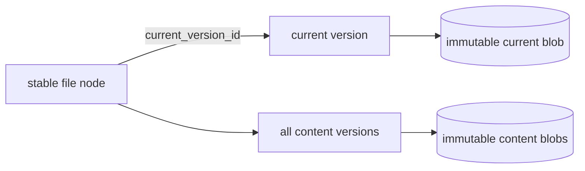

# Editing and versions

Docbank does not currently expose content replacement, version listing, or
version retrieval. A file node points at the blob imported with it; users can
rename, move, trash, and restore that node without changing its bytes.

## Implemented foundation

The current development schema includes
`node_versions(node_id, blob_hash, size, replaced_at)`, and GC treats rows in
that table as reachability roots. No command or API route writes or reads those
rows. This placeholder is not a compatibility contract and will be replaced
before the first public release.

The storage invariant already applies: a canonical blob is immutable. Any
content-replacement feature must publish a new durable blob and change metadata
transactionally; it cannot edit bytes in place without invalidating its hash.

## Planned model and surfaces

!!! info "Planned — Phase 2b"
    Before the first editing writer lands, the live schema and deterministic
    JSONL format v1 will adopt the final identity model directly. Docbank has no
    deployed vaults to migrate: development vaults created with earlier shapes
    are disposable, and no bootstrap, compatibility decoder, format-v2 cutover,
    or downgrade fence will be built for them.

    Every file is created with a stable current content-version record. A
    document node remains the stable identity while its content pointer changes.
    Replacing content will:

    1. hash and durably publish the new bytes;
    2. create an immutable content-version record for the new head, including
       its blob hash, size, media type, introducing operation, transition kind,
       and resulting node revision; and
    3. point the node at that version, update metadata, and bump its revision in
       the same SQLite transaction.

    Initial ingest creates revision-one `content_create`. Replacement creates
    `content_replace`. Reversion creates a new `content_revert` head that names
    the older source version; it never rewinds or deletes later history. A
    metadata transaction creates at most one version for a node, enforced by
    unique `(node_id, node_revision)` and `(node_id,
    introduced_operation_id)` constraints.

    Version, operation, vault, tag, and ingest identities are random UUIDv4
    values in canonical lowercase form. They are never derived from sequential
    allocators, hashes, or clocks and are never reused after deletion. Node IDs
    remain monotonic integers because they are already stable API identities;
    JSONL preserves their allocator high-water mark.

    Node names, trash-origin names, provenance paths, and ingest source
    descriptions are opaque bytes encoded as canonical unpadded base64url in
    JSONL. Provenance facts use deterministic CAE2 identities. A supersession
    chain stays on one node and has at most one direct successor, making its
    active leaf unambiguous.

    The single metadata-v1 authority carries the vault ID, node allocator,
    content versions and current pointers, tag/ingest/provenance identities,
    directory and trash topology, and later audit records. Enabling the first
    audit scope adds audit genesis and history to that same v1 format; it does
    not change formats or store generations.

    Versions are whole-content snapshots, not diffs. Identical bytes still
    deduplicate. A crash before the metadata transaction commits leaves the old
    head intact with at most an orphan blob for GC.

    Planned CLI surfaces are `versions`, `put`, `revert`, and `edit`. Planned
    HTTP surfaces are `PUT /nodes/{id}/content`,
    `GET /nodes/{id}/versions`, and version-content retrieval. ID-addressed
    replacement requires `If-Match` so concurrent edits fail with 412 rather
    than losing an update.

    Version pruning is explicit and releases blob reachability only when its
    metadata row is removed. No automatic retention policy is the default. A
    version protected by a [full-audit scope](audited-history.md) is never
    eligible for ordinary pruning.

## Why blobs will not be edited in place

In-place mutation would break the defining guarantees simultaneously: the
object name would stop matching its SHA-256, duplicate references would observe
unexpected changes, a partial write could tear content, and the previous bytes
would be lost. Keeping the byte layer append-only makes transactional pointer
replacement the only compatible editing model.
