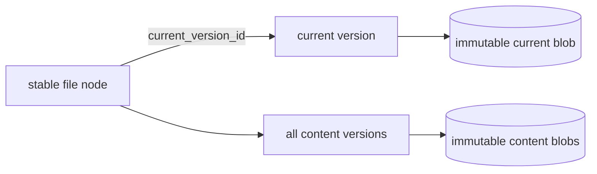

# Editing and versions

Every file enters Docbank with a stable content-version identity. The file node
is document identity; the version identifies one immutable set of bytes. Users
and agents can list versions, inspect one by UUID, and retrieve its bytes even
after the node moves or is renamed.

Content replacement and reversion are not implemented yet, so a newly created
file currently has exactly one version. Establishing the identity and read
contract at ingest means later editing can add history without redefining
existing files or backups.

## Version contract

Initial ingest and remote upload create an immutable `content_create` record in
the same SQLite transaction as the file node. The record carries:

- a random, canonical UUIDv4 `version_id` that is never allocator-derived;
- the stable node ID and node revision that introduced it;
- SHA-256, byte length, and media type for the immutable blob;
- a canonical UTC recording time; and
- a separate random operation UUID and transition kind.

The node's `current_version_id` points to a version belonging to that same node.
SQLite enforces the cross-reference, one version per node revision, and one
version per node/operation pair. Two files containing identical bytes share one
blob but still receive distinct version and operation identities.

Moves, renames, trash, and restore change node metadata and revisions without
creating content versions. An idempotent re-import that skips an existing file
also creates no version.

## Read surfaces

```bash
docbank versions /taxes/2025/return.pdf
docbank version <version-id> --json
docbank version <version-id> --content > return.pdf
```

`versions` is newest-first and bounded by `--limit` and `--offset`; `--json`
returns the complete page envelope including `total`. `version` addresses
metadata or bytes by UUID, independent of the node's current path.

The HTTP equivalents are:

- `GET /api/v1/nodes/{id}/versions?limit=&offset=`;
- `GET /api/v1/versions/{version_id}`; and
- `GET /api/v1/versions/{version_id}/content`.

Current-node and ID-addressed version streams both send
`X-Docbank-Content-Version`, `X-Docbank-Blob-Hash`, and
`X-Docbank-Blob-Size` before the body, then a computed `Content-Digest` trailer
after successful EOF. A client must still hash privately staged bytes and
compare the trailer before publishing them.

## Retention and backup

Every content-version row is a GC reachability root, whether or not it is the
current head. Deleting a file's tree metadata through trash empty removes its
versions; only then can unreferenced blobs become GC candidates. Repack may
change physical placement but not version identity.

Deterministic metadata JSONL includes every version and every node's current
pointer. Backup capture, verification, and restore therefore preserve stable
version IDs across loose or packed physical representations. Import rejects
dangling current pointers, cross-node pointers, size disagreement, invalid UUIDs,
and malformed JSON records transactionally.

## Planned editing model

!!! info "Planned — Phase 2b"
    A document node remains stable while its content pointer changes. Replacing
    content will:

    1. hash and durably publish the new bytes;
    2. create an immutable content-version record for the new head, including
       its blob hash, size, media type, introducing operation, transition kind,
       and resulting node revision; and
    3. point the node at that version, update metadata, and bump its revision in
       the same SQLite transaction.

    Initial ingest already creates revision-one `content_create`. Replacement
    will create `content_replace`. Reversion will create a new `content_revert` head that names
    the older source version; it never rewinds or deletes later history. A
    metadata transaction creates at most one version for a node, enforced by
    unique `(node_id, node_revision)` and `(node_id,
    introduced_operation_id)` constraints.

    Versions are whole-content snapshots, not diffs. Identical bytes still
    deduplicate. A crash before the metadata transaction commits leaves the old
    head intact with at most an orphan blob for GC.

    Planned write surfaces are `put`, `revert`, and `edit` plus
    `PUT /nodes/{id}/content`. ID-addressed replacement requires `If-Match` so
    concurrent edits fail with 412 rather than losing an update.

    Version pruning is explicit and releases blob reachability only when its
    metadata row is removed. No automatic retention policy is the default. A
    version protected by a [full-audit scope](audited-history.md) is never
    eligible for ordinary pruning.



## Why blobs will not be edited in place

In-place mutation would break the defining guarantees simultaneously: the
object name would stop matching its SHA-256, duplicate references would observe
unexpected changes, a partial write could tear content, and the previous bytes
would be lost. Keeping the byte layer append-only makes transactional pointer
replacement the only compatible editing model.
