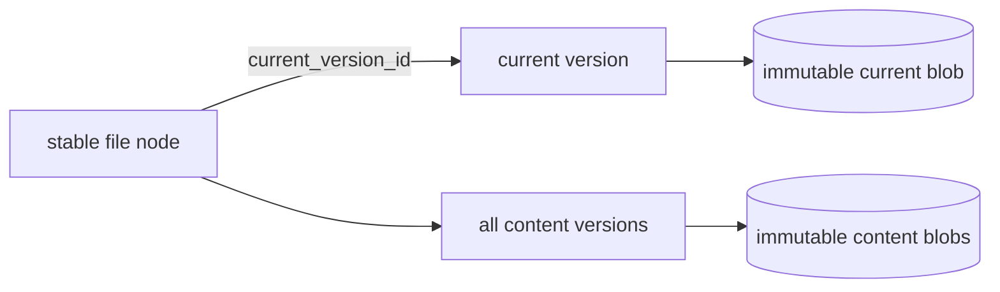

# Editing and versions

Every file enters Docbank with a stable content-version identity. The file node
is document identity; the version identifies one immutable set of bytes. Users
and agents can list versions, inspect one by UUID, and retrieve its bytes even
after the node moves or is renamed.

Content replacement is implemented by `docbank put`, interactive replacement
by `docbank edit`, and reversion by `docbank revert`. Each changed result adds
immutable history instead of rewriting an existing version.

## Version contract

Initial ingest and remote upload create an immutable `content_create` record in
the same SQLite transaction as the file node. The record carries:

- a random, canonical UUIDv4 `version_id` that is never allocator-derived;
- the stable node ID and node revision that introduced it;
- SHA-256, byte length, and media type for the immutable blob;
- a canonical UTC recording time; and
- a separate random operation UUID and transition kind.

The node's `current_version_id` points to a version belonging to that same node.
SQLite enforces the cross-reference, one version per node revision, and one
version per node/operation pair. Two files containing identical bytes share one
blob but still receive distinct version and operation identities.

Moves, renames, trash, and restore change node metadata and revisions without
creating content versions. An idempotent re-import that skips an existing file
also creates no version.

## Read surfaces

```bash
docbank versions /taxes/2025/return.pdf
docbank version <version-id> --json
docbank version <version-id> --content > return.pdf
docbank refs <sha256>
```

`versions` is newest-first and bounded by `--limit` and `--offset`; `--json`
returns the complete page envelope including `total`. `version` addresses
metadata or bytes by UUID, independent of the node's current path.
`refs` performs the inverse lookup: one content hash to every stable
node/version pair that retains it, including prior versions and trash.

The HTTP equivalents are:

- `GET /api/v1/nodes/{id}/versions?limit=&offset=`;
- `GET /api/v1/versions/{version_id}`;
- `GET /api/v1/versions/{version_id}/content`;
- `GET /api/v1/content-references?sha256=&limit=&offset=`.

Current-node and ID-addressed version streams both send
`X-Docbank-Content-Version`, `X-Docbank-Blob-Hash`, and
`X-Docbank-Blob-Size` before the body, then a computed `Content-Digest` trailer
after successful EOF. A client must still hash privately staged bytes and
compare the trailer before publishing them.

## Retention and backup

Every retained content-version row is a GC reachability root, whether or not it
is the current head. Explicit version pruning or deletion of a file's tree
metadata through trash empty can release those references; only then can an
unreferenced blob become a GC candidate. Repack may change physical placement
but not version identity.

Deterministic metadata JSONL includes every version and every node's current
pointer. Backup capture, verification, and restore therefore preserve stable
version IDs across loose or packed physical representations. Import rejects
dangling current pointers, cross-node pointers, size disagreement, invalid UUIDs,
and malformed JSON records transactionally. A backup captured after pruning
preserves the retained graph and does not resurrect deleted version rows.
Earlier snapshots remain independent historical records and can still restore
the state they captured.

## Replacing content

```bash
docbank put revised.pdf /taxes/2025/return.pdf
```

`put` opens a regular source without following a final symlink, detects or
accepts its media type, and hashes it before starting or contacting the daemon.
It then inspects the target and uploads with that node revision. Keeping the
local pass outside the daemon lifecycle avoids idle shutdown during a slow read
and shortens the optimistic-concurrency window. Hashing and upload have separate
progress stages because the daemon requires the expected SHA-256 and size before
granting authority. The client uses `Expect: 100-continue`, allowing the daemon
to reject a stale or invalid target before the large body is transmitted.

The corresponding `PUT /api/v1/nodes/{id}/content` body is the raw file bytes.
It requires `If-Match`, `X-Docbank-Blob-Hash`, and
`X-Docbank-Blob-Size`; `Content-Type` becomes version metadata. The daemon
durably writes and independently hashes the body first. Only an exact match
allows one transaction to create the `content_replace` record, advance
`current_version_id`, update metadata, and bump the node revision. The response
returns the new node and version plus the computed identity and resulting ETag.

A stale revision fails with `412`; a size or digest mismatch fails with `422`.
Neither grants new metadata or blob authority. A crash or rejection after the
durable write may leave an authority-free loose object for ordinary GC. The old
head remains readable throughout. Even a replacement with identical bytes
creates a distinct version and operation while content storage deduplicates the
shared blob.

## Interactive editing

```bash
docbank edit /taxes/2025/notes.md
```

`edit` privately stages the current immutable version and accepts the staged
file only after its version ID, size, SHA-256, and terminal content digest all
verify. It then runs the blocking command selected by `--editor`, `VISUAL`, or
`EDITOR`, falling back to `vi` on Unix and Notepad on Windows. Unix editor
commands use shell-style quoting; Windows commands use native Windows
command-line parsing so quoted executable paths and backslashes remain intact.
Docbank does not invoke a shell. The editor must wait until the file is closed.

After the editor exits successfully, Docbank hashes the result. Unchanged bytes
and media type create no version. A change is uploaded through the same verified
replacement contract as `put`, using the node revision inspected before the
editor opened. A concurrent replacement, move, or trash therefore causes a
stale-revision failure instead of overwriting either writer. Because an editing
session may outlive daemon idle shutdown, Docbank reacquires the daemon only
after local hashing. The current media type is preserved unless `--mime-type`
sets a new one. Download, hash, and upload stages have progress output.

The staged directory and file are private and removed on success, no-op, editor
failure, or upload failure. If cleanup fails after a replacement has already
committed, the command reports the successful version and emits a warning
rather than falsely inviting a retry.

## Reverting content

```bash
docbank revert /taxes/2025/return.pdf <prior-version-id>
```

Reversion is a metadata-only content transition. The selected version must
belong to the target file and must not already be its current head. Under the
target's inspected revision, one transaction creates a new `content_revert`
version with the source's exact blob hash, size, and media type; records the
source version ID; advances `current_version_id`; and bumps the node revision.
No loose or packed bytes are read, copied, or rewritten.

The source and every intervening version remain immutable and addressable. A
later repeat of the same historical choice creates another explicit revert
operation rather than reusing the earlier history row. Because no content is
destroyed, reversion needs no destructive confirmation. A stale node fails with
`412`; a source from another node and an already-current source fail with
structured `422` errors.

`POST /api/v1/nodes/{id}/revert` accepts `source_version_id` with `If-Match`.
Its receipt returns the resulting node, the new reversion row, the complete
source version, and the resulting ETag. Clients accept success only when all
node, revision, source, and content-authority fields agree.

## Choosing retention

`put`, changed `edit` sessions, and `revert` retain every prior content version
by default. Docbank does not choose an age or history limit for the operator.
When a file's old versions are no longer wanted, pruning is explicit and
preview-first:

```bash
docbank versions prune /taxes/2025/return.pdf --keep-newest 3
docbank versions prune /taxes/2025/return.pdf --older-than 365d
docbank versions prune /taxes/2025/return.pdf --version <version-id>
docbank versions prune /taxes/2025/return.pdf --all-prior
```

Exactly one selector is accepted. Nothing changes without `--run`, and every
request is bound to the node ID and revision inspected by the client. The
current content is always retained. Ordinary selectors never select the
current row and also retain any source version still required by a remaining
`content_revert` record, reporting that dependency rather than producing a
dangling history graph. `--all-prior` can release the complete older graph;
when the current head is itself a revert, the transaction first installs a
same-byte, source-free `content_replace` checkpoint and then removes the old
graph, including the superseded revert head.

An age selection is evaluated against the wall-clock cutoff reported in that
request. Time can advance without changing a node revision, so a later
`--older-than ... --run` request may include additional versions that crossed
the boundary after the preview. This never selects a version younger than the
requested age. When exact replay of a preview matters, execute its returned
candidate IDs with repeated `--version` selectors instead. Explicit-ID requests
are bounded to 1,000 IDs; larger selections can be applied in batches, reading
the advanced node revision before each subsequent batch.

Pruning deletes version authority, not bytes. Its report distinguishes logical
bytes, shared blobs that remain reachable, loose blobs that become eligible for
`gc`, and packed payload that needs `gc` followed by `storage repack`. A run
that deletes versions advances the node revision exactly once; an empty
selection is a no-op. There is no automatic retention policy.



## Why blobs will not be edited in place

In-place mutation would break the defining guarantees simultaneously: the
object name would stop matching its SHA-256, duplicate references would observe
unexpected changes, a partial write could tear content, and the previous bytes
would be lost. Keeping the byte layer append-only makes transactional pointer
replacement the only compatible editing model.
