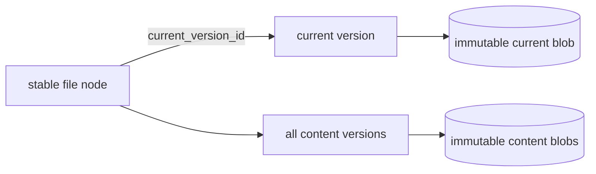

# Editing and versions

Docbank does not currently expose content replacement, version listing, or
version retrieval. A file node points at the blob imported with it; users can
rename, move, trash, and restore that node without changing its bytes.

## Implemented foundation

The schema includes `node_versions(node_id, blob_hash, size, replaced_at)`, and
GC treats rows in that table as reachability roots. This reserves a safe place
for prior immutable contents, but no current command or API route writes or
reads version rows. The reserved shape is not yet a public contract and will be
evolved before the first writer so versions have stable identity and can
participate in [audited history](audited-history.md).

The storage invariant already applies: a canonical blob is immutable. Any
content-replacement feature must publish a new durable blob and change metadata
transactionally; it cannot edit bytes in place without invalidating their hash.

## Planned model and surfaces

!!! info "Planned — Phase 2b"
    A document node will remain the stable identity while its content pointer
    changes. Replacing content will:

    1. hash and durably publish the new bytes;
    2. create a stable content-version record for the new head, including its
       blob hash, size, media type, and resulting node revision; and
    3. point the node at that version, update metadata, and bump its revision in
       the same SQLite transaction. The previous version record remains
       unchanged.

    Initial ingest likewise creates a stable first version and makes it the
    node's current version. Reversion creates another new head/version identity
    that may reference an older blob. Every current or historical head is
    therefore addressable before it is ever displaced.

    Versions will be whole-content snapshots, not diffs. Identical bytes will
    still deduplicate, and a crash before the metadata transaction commits will
    leave the old head intact with at most an orphan blob for GC.

    Planned CLI surfaces are `versions`, `put`, `revert`, and `edit`. Planned
    HTTP surfaces are `PUT /nodes/{id}/content`,
    `GET /nodes/{id}/versions`, and version-content retrieval. ID-addressed
    replacement will require `If-Match` so concurrent edits fail with 412
    rather than losing an update.

    Reverting will create a new head from old content rather than erase later
    history. Version pruning will be explicit and will release blob
    reachability only when its metadata row is removed. No automatic retention
    policy is planned as a default. A version protected by a
    [full-audit scope](audited-history.md) is never eligible for ordinary
    pruning, regardless of any bounded retention policy on other documents.

## Why blobs will not be edited in place

In-place mutation would break the defining guarantees simultaneously: the
object name would stop matching its SHA-256, duplicate references would observe
unexpected changes, a partial write could tear content, and the previous bytes
would be lost. Keeping the byte layer append-only makes transactional pointer
replacement the only compatible editing model.
