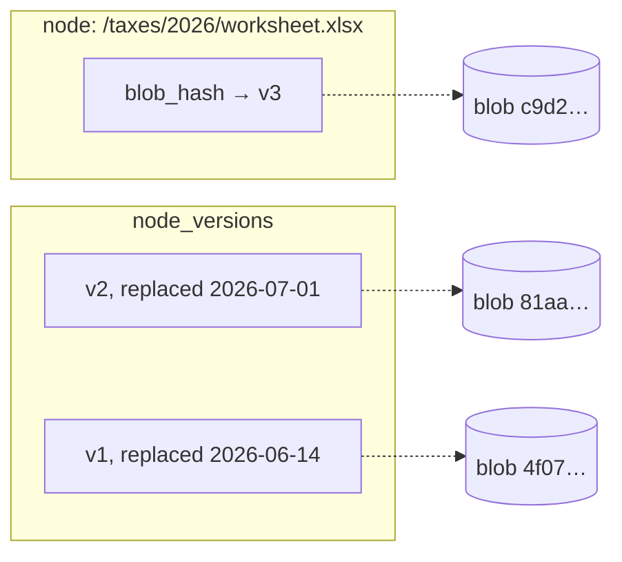

# Editing & Versions

docbank's defining difference from msgvault is that **documents are
editable**. A message archive preserves a fixed historical record; a
document vault manages files you're still working on — the tax
spreadsheet you update, the contract that goes through drafts, the scan
you annotate. docbank must let you edit a document in place *without*
giving up the archive guarantees that justify trusting it with the only
copy.

The design squares that circle by keeping mutability out of the byte
layer entirely.

## The model: mutable documents, immutable contents

A document (a file node) is a **named pointer into the content-addressed
store**. Editing never rewrites bytes; it re-points the node:

1. The new content is ingested like any import: hashed, written durably
   to `blobs/<aa>/<sha256>`, deduplicated if it already exists.
2. One transaction records the node's current `(blob_hash, size)` in
   `node_versions` with a `replaced_at` timestamp, points the node at
   the new blob, updates `size`/`mime_type`/`modified_at`, and bumps the
   node's `revision`.



Consequences, all inherited rather than engineered:

- **Every edit is a version.** History is nearly free in a CAS — a
  version costs one metadata row, and unchanged bytes are shared. Ten
  drafts of a contract that each change one page store ten full blobs
  only if all ten differ; identical saves deduplicate to nothing.
- **No torn writes.** The new content is durable before the swap
  commits, and the swap is atomic. A crash mid-edit leaves the document
  at the old version with, at worst, an orphan blob for `gc`.
- **History is protected from GC.** Reachability already includes
  `node_versions`, so prior contents survive `gc --run` until their
  version records are explicitly pruned.
- **Concurrent edits are detectable.** The revision bump is the
  `If-Match` precondition token in the HTTP API — two agents editing the
  same document get a `412`, not a lost update.

What versioning is **not**: a diff engine. Versions are whole-content
snapshots; v1 exposes listing and retrieving them, nothing more. And
version history is linear per node — restoring an old version creates a
*new* head version rather than rewinding, so history only grows until
you prune it.

## Editing surfaces

!!! info "Planned — Phase 2b"
    The version machinery (schema, GC reachability) shipped in Phase 1,
    but no user-facing editing surface exists yet. The surfaces below
    are the design commitment; exact flags and shapes land in the CLI
    reference and OpenAPI spec when they ship.

**CLI.**

```
docbank versions <path|id>              # list: version, size, replaced_at
docbank cat <path> --version <n>        # retrieve a prior content
docbank put <src-file> <path|id>        # replace content from a local file
docbank revert <path|id> --version <n>  # old content becomes the new head
docbank edit <path|id>                  # materialize → $EDITOR → save back
```

`edit` is the ergonomic core: materialize the blob to a temp file, open
the user's editor (or, with `--app`, the platform default application),
and on exit re-ingest if the bytes changed. It must handle the
disciplined case (editor exits after save) and warn on the undisciplined
one (file unchanged at exit — many GUI apps detach; `put` is the
fallback).

**HTTP.** `PUT /nodes/{id}/content` with a required
`If-Match: <revision>` precondition replaces content;
`GET /nodes/{id}/versions` lists history;
`GET /nodes/{id}/versions/{n}/content` retrieves it. Agents edit
documents through exactly the read-modify-write loop the
[HTTP API](http-api.md) concurrency model is built for.

**TUI (Phase 3).** "Open for editing" — materialize, hand to the default
app, watch for changes, re-ingest — plus a version list per document.

## Retention

Version history grows monotonically until pruned. v1 keeps everything —
document edits are low-frequency, human-scale events, and disk is
cheaper than a lost draft. The design reserves explicit pruning
(`docbank versions prune --keep <n>` / `--older-than <age>`), which
deletes `node_versions` rows and thereby releases those blobs to `gc`.
Automatic retention policy, if it ever exists, will be configuration,
never a default.

## Why not edit blobs in place?

Rejected because it would forfeit every guarantee at once: dedup breaks
(the blob's name would no longer be its hash), crash-safety breaks
(partial in-place writes), history breaks (the old bytes are gone), and
concurrent readers break (a `cat` streaming during an edit would see a
tear). The CAS stays append-only; documents mutate one metadata pointer
at a time. This is also what keeps docbank compatible with the shared
`kit` backup engine, whose incremental model assumes content files never
change under it.
