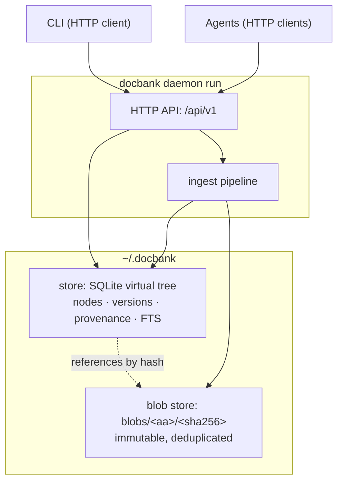

# Architecture overview

docbank separates **what a document is** from **where it lives and what
it's called**. Bytes go into an immutable content-addressed store;
identity, naming, hierarchy, provenance, and search metadata live in SQLite. One
process — the [daemon](daemon.md) — owns both, and every consumer (the CLI and
agents) goes through its [HTTP API](http-api.md), so no client surface has
privileged storage access.

## Reading map

| Question | Page |
|----------|------|
| What is stored, and which invariants are enforced? | [Storage](storage.md) |
| How can loose and packed bytes coexist? | [Packed Storage](packed-storage.md) |
| Why can only one process open the vault? | [Daemon](daemon.md) and [Concurrency & Locking](locking.md) |
| What contract do the CLI and agents share? | [HTTP API](http-api.md) |
| Which failures and adversaries are in scope? | [Integrity & Threat Model](integrity.md) |

The [Roadmap](../roadmap.md) is the authority for planned features. These
architecture pages describe implemented boundaries first and isolate future
behavior in explicit planned callouts.

## The two-layer split

**Blobs are immutable.** A blob's name is the SHA-256 of its content;
two ingested copies of the same file are one blob. Blobs are written
durably (temp file → fsync → rename → directory fsync) *before* any
database row references them, so a committed reference always points at real
bytes. Blobs are never modified.

**The tree is mutable, transactionally.** Nodes (directories and files)
form the hierarchy users see. Moves, renames, trash, and restore are single
SQLite transactions over metadata. The
store enforces the tree invariants — single root, live-sibling name
uniqueness, no cycles, validated NFC-normalized names — mostly *in the
schema itself* (partial unique indexes, CHECK constraints), so they hold
against every future writer, not just today's code paths.

This split is what makes docbank cheap to reorganize (moving a folder of
scans is a metadata transaction) and safe to deduplicate (identity is
content, so re-imports converge instead of duplicating).

## Contrast with msgvault

msgvault archives an immutable historical record: a message, once synced,
never changes. docbank manages a user-controlled document tree whose names and
organization keep evolving. The designs share content-addressed bytes, SQLite
metadata, durability rules, and physical storage primitives from
`go.kenn.io/kit`, but their organization and deletion policies differ:

| | msgvault | docbank |
|---|---|---|
| Stored bytes | Immutable content-addressed objects | Immutable content-addressed objects |
| Organizing structure | Fixed (accounts, folders, threads from source) | Free-form virtual tree, user- and agent-reorganized |
| Deletion | Staged deletion *from the source* (Gmail) | Trash → empty → GC pipeline inside the vault |

!!! info "Planned — versioned editing"
    Docbank's document identity is intended to outlive any one content blob.
    Content replacement will write a new immutable blob and retain the prior
    hash in `node_versions`; no editing command or writer exists today. See
    [Editing & Versions](editing-and-versions.md).

## Component responsibilities

- **`internal/store`** — SQLite schema and every tree operation. Typed
  sentinel errors (`ErrNotFound`, `ErrExists`, `ErrCycle`, …) that the
  API maps to HTTP status codes and machine-readable error codes, and
  the client maps back so CLI error messages stay typed end to end.
- **`internal/blob`** — content-addressed file store with the fsync
  discipline; knows nothing about the tree.
- **`internal/ingest`** — the single import pipeline all entry points
  share: hash → durable blob → one metadata transaction per file. The
  daemon is its caller (`POST /ingest`, backing `docbank add`).
- **`internal/home`** — vault directory layout and the vault lock the
  daemon holds exclusively ([Concurrency & Locking](locking.md)).
- **`internal/config`** — optional `config.toml` loading and the
  bind/key validation ([Configuration](../configuration.md)).
- **`internal/api`** — the huma v2 HTTP surface: routes, middleware,
  auth, the maintenance gate ([HTTP API](http-api.md)).
- **`internal/client`** — the typed HTTP client plus daemon
  discovery/auto-start ([Daemon](daemon.md)); shares request/response
  types with `internal/api`.
- **`cmd/docbank`** — thin cobra commands; no business logic. Data
  commands are `internal/client` calls; `daemon run` is the one command
  that opens the store and blob directory, because it *is* the daemon.

## Boundary summary

- The daemon alone owns SQLite and physical blob storage.
- SQLite owns logical identity, hierarchy, reachability, and transactional
  invariants.
- Kit owns application-neutral loose/packed storage mechanics; docbank owns
  catalog authority and garbage-collection policy.
- The HTTP API is the sole data contract for clients, including the CLI.
- Stable node IDs identify objects; paths are mutable addressing conveniences.
- Trash, permanent metadata deletion, and physical byte reclamation are
  separate decisions.

!!! info "Planned — later clients and features"
    Versioned editing, tags, watched inboxes, text extraction, the TUI, and
    built-in backup commands are designed but not implemented. They must fit
    the boundaries above rather than introduce a privileged path around the
    daemon or mutable blob bytes. See the [Roadmap](../roadmap.md).
