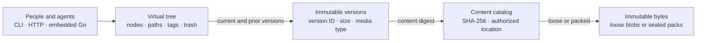

# How Docbank works

Docbank presents a familiar tree of directories and files, but it is not a
folder of ordinary files. It is a document system built from two cooperating
parts:

- **SQLite metadata** describes the tree people and agents work with: stable
  document identity, paths, versions, tags, provenance, trash state, and
  search indexes.
- **Immutable content storage** holds the bytes, addressed by their SHA-256
  digest and stored either as individual files or inside sealed pack files.

Separating those parts makes large reorganizations cheap, deduplicates
identical content, retains version history without copying mutable files in
place, and lets backup rebuild the same logical vault independently of its
physical layout.

Docbank does not assume one global archive per machine. A person or application
may operate many independent vaults, each with its own identity, metadata,
content, policy, and backup history.

## The model in one minute

Five ideas explain most of the system:

1. A **vault** is one independent document collection. Its database and content
   store are one logical unit.
2. A **node** is a directory or file with a stable numeric ID. Its path can
   change without changing which document it is.
3. A file's **content version** is an immutable historical record with its own
   random UUID. Editing or reverting creates a new version; it never rewrites
   an old one.
4. A **blob** is the byte content of one or more versions. Its SHA-256 digest is
   its identity, so byte-identical files share storage automatically.
5. The **catalog** decides which bytes are authoritative and where Docbank may
   read them. A loose file or pack entry found on disk has no authority by
   itself.

The arrows matter. A path resolves to a node; a file node selects a current
version; a version names a content digest; and the catalog selects an
authorized physical representation. Skipping a layer would make mutable names
or stray files into accidental authority.

## Identity, addressing, and authority

These values answer different questions and are intentionally not
interchangeable:

| Value | What it answers | Stability and authority |
| --- | --- | --- |
| Vault ID | Which independent collection is this? | Stable across backup and restore |
| Node ID | Which directory or file is this? | Stable across moves, renames, trash, and restore |
| Path | Where is the node shown now? | Mutable addressing convenience, derived from the tree |
| Node revision | Which observed node state am I changing? | Advances on mutation; used by `If-Match` to reject stale writes |
| Version ID | Which historical file state is this? | Random, immutable, and independent of the node's current path |
| Blob digest | Which exact bytes are these? | SHA-256 of the content; identical bytes have one identity |
| Catalog membership and mapping | May Docbank read this content, and from where? | A `blobs` row grants authority; an optional pack mapping selects packed rather than loose storage |

This is why an automation should remember node and version IDs, not paths
alone. It is also why finding a correctly named file under `blobs/` does not
make that file part of the vault: only a committed catalog reference does.

## How a write becomes authoritative

Every content-write surface follows one ordering rule: prove and publish bytes
before committing metadata that names them.

1. Docbank streams the source into private staging while counting and hashing
   it. A verified upload or replacement must declare the expected size and
   digest; a mismatch ends the operation without granting node authority.
2. The content store syncs the completed bytes, closes them, publishes them
   under their digest, and syncs the containing directory.
3. One SQLite transaction creates or updates the node, records the immutable
   content version, and grants the blob catalog authority.

The entry points differ in what the caller can know and what evidence comes
back:

| Write surface | Caller contract | Success evidence |
| --- | --- | --- |
| Server-side `/ingest` | Names paths readable by the daemon host; Docbank computes each identity | Aggregate added, skipped, excluded, and failure results for the traversal |
| Remote `/uploads` | Must declare destination, size, and SHA-256 before streaming one file | Status, committed node projection, and independently computed size and digest |
| Content replacement | Must declare size and SHA-256 and supply `If-Match` for the stable node | Committed node and version, computed identity, resulting revision, and ETag |

If the process fails before step 3, durable bytes may exist without a database
reference. They are harmless orphans: normal reads cannot see them, and garbage
collection can reclaim them later. The reverse state—a committed version whose
bytes were never durably published—is prevented by the ordering.

Tree mutations such as move, rename, trash, restore, tag assignment, reversion,
and version pruning happen in SQLite transactions. Path-based mutation
endpoints resolve the path and perform the change in the same transaction, so
a concurrent move cannot silently redirect the operation.

## How a read is proved

A read walks the authority chain in the opposite direction:

1. Resolve a path or node ID to a file node.
2. Select its current version, or address a historical version directly.
3. Resolve that version's digest through the catalog.
4. Stream the authorized loose blob or pack entry while verifying its recorded
   framing, size, and SHA-256 digest.

Receiving some bytes is not yet proof of a complete read. The typed clients
accept content only after reaching terminal EOF and validating the terminal
`Content-Digest` trailer. Embedded streaming follows the same rule: an early
close is incomplete verification, not success.

## Editing, deletion, and reclamation are separate

Docbank keeps logical decisions distinct from physical storage maintenance:

| Operation | What changes | What does not happen yet |
| --- | --- | --- |
| Edit or replace | Adds an immutable version and advances the file's current pointer | Prior versions are not rewritten |
| Revert | Adds a new version that records the selected historical source | History is not rewound or erased |
| Version prune | Removes selected history under a revision check; dry-run is the default, but execution may be requested directly | Current content remains; `--all-prior` may replace a current revert with a same-byte checkpoint before deleting the prior version identity, and shared bytes may remain live |
| Trash | Detaches a subtree from the live tree while retaining its identity, bytes, and restore coordinates | No content is physically reclaimed |
| Trash empty | Permanently removes selected trashed metadata | Unreferenced loose files and dead pack entries may still occupy disk |
| GC | Removes unreferenced catalog authority and loose bytes | Dead entries inside an immutable pack do not shrink that pack |
| Repack | Copies live pack entries into new packs and retires sparse old packs | Logical document history is not changed |

This staging provides a regret window without pretending storage is free.
Users and agents can retain every edit by default, deliberately prune unwanted
history, empty trash on their own schedule, and reclaim packed space only when
repacking is worthwhile. [Editing & Versions](editing-and-versions.md) and
[Trash, GC, Repack & Verify](../usage/trash-and-gc.md) give the command-level
contracts.

## Loose and packed bytes are one content store

New content is published as a loose, digest-named file. Packing later combines
eligible small blobs into sealed immutable pack files, reducing filesystem
enumeration and backup overhead. The catalog changes representation without
changing the blob digest, version identity, or document path.

Readers therefore do not care whether content is loose or packed. Backup also
captures logical content, not the source pack layout, and restore may publish a
different valid representation under fresh catalog authority. See
[Loose & Packed Content](packed-storage.md) for limits, maintenance, and the
boundary between Docbank policy and Kit mechanics.

## Search indexes are derived

Lexical name and verified-text search is reconstructed from authoritative
metadata during restore. When embeddings are configured, the daemon can also
mirror current live extracted text into `vectors.db` and build versioned vector
generations through Kit's SQLite vector substrate. The active generation is
swapped only after the replacement completely covers that mirror.

Neither extracted search projections nor `vectors.db` grant document
authority. The vector sidecar is excluded from JSONL and backup snapshots; it
can be deleted while the daemon is stopped and rebuilt from verified current
text. Embedded applications do not import this daemon-owned vector layer and
may continue using the root Go package with pure-Go SQLite and no CGo vector
dependency. See [Embedding Index](../usage/embeddings.md).

## One owner, two integration modes

Exactly one process owns an open vault at a time:

- In **daemon mode**, `docbank daemon run` owns SQLite and content storage. The
  CLI is a thin authenticated HTTP client, as are other local tools and agents.
  Discovery and auto-start do not create a second storage owner.
- In **embedded mode**, one Go application owns a separately rooted vault
  through the Go package. It uses the same metadata, content authority, verified
  reads, locking, and packing rules without running a sidecar daemon.

A vault is not shared between the two modes concurrently. Hierarchical locks
also prevent a daemon or restore from operating inside an already owned vault
tree. [Ownership & Concurrency](locking.md), [Daemon & Process Model](daemon.md),
and [Embed in Go](../embedding.md) describe those boundaries.

## Backup reconstructs meaning, not a live database copy

Snapshot repositories are append-only and incremental. Each snapshot contains
a complete deterministic JSONL description of the logical vault plus every
catalog-authorized content blob. Unchanged objects are reused by digest across
snapshots.

Restore verifies repository content, imports JSONL into a fresh current-schema
database, reconstructs search and physical catalog state, checks SQLite and
manifest statistics, and only then publishes the result. Source loose-versus-
packed placement is not logical metadata. This makes backup a recovery contract
rather than a fragile copy of a running SQLite file. See
[Backup & Recovery](backup.md).

## Integrity boundary

Docbank is designed to detect truncation, corruption, stale writes, malformed
metadata, and incomplete recovery within its application and storage
boundaries. SHA-256 identifies bytes; revisions and ETags bind mutations to
observed state; catalog authority excludes stray storage; full verification
reads and hashes content; and restore validates the logical relations before
publication.

These mechanisms do not make a host administrator, compromised process, or
someone able to rewrite both data and expected evidence harmless. The
[Integrity & Trust](integrity.md) page states what is proved, when it is proved,
and which threats require independent evidence.

## Where to go next

| If you want to understand… | Read… |
| --- | --- |
| The on-disk database, blob tree, and enforced invariants | [Storage](storage.md) |
| Loose publication, packs, GC, and repacking | [Loose & Packed Content](packed-storage.md) |
| Stable versions, replacement, reversion, and pruning | [Editing & Versions](editing-and-versions.md) |
| Process ownership and mutation coordination | [Ownership & Concurrency](locking.md) and [Daemon & Process Model](daemon.md) |
| Incremental snapshots and safe publication on restore | [Backup & Recovery](backup.md) |
| The contract shared by the CLI and agents | [HTTP API](http-api.md) |
| What integrity checks do and do not establish | [Integrity & Trust](integrity.md) |
| Permanent retention, history, and verification | [Audited History](audited-history.md) |

The [Roadmap](../roadmap.md) gives high-level product direction. These pages
explain implemented behavior and durable design intent; planned behavior is
marked explicitly. Kata, rather than the documentation, is the authority for
implementation work and status.
