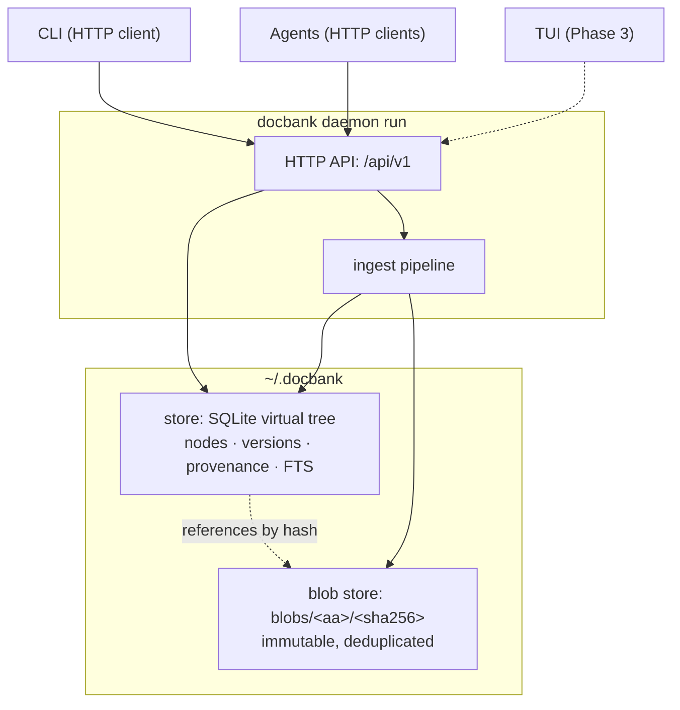

# Design Overview

docbank separates **what a document is** from **where it lives and what
it's called**. Bytes go into an immutable content-addressed store;
identity, naming, hierarchy, versions, and history live in SQLite. One
process — the [daemon](daemon.md) — owns both, and every consumer (the
CLI today; agents; the TUI and a real web frontend later) goes through
its [HTTP API](http-api.md), so no surface has privileged operations.

## The two-layer split

**Blobs are immutable.** A blob's name is the SHA-256 of its content;
two ingested copies of the same file are one blob. Blobs are written
durably (temp file → fsync → rename → directory fsync) *before* any
database row references them, so a committed reference always points at
real bytes. Blobs are never modified — "editing" a document means
writing a new blob (see
[Editing & Versions](editing-and-versions.md)).

**The tree is mutable, transactionally.** Nodes (directories and files)
form the hierarchy users see. Moves, renames, trash, restore, and
content replacement are single SQLite transactions over metadata. The
store enforces the tree invariants — single root, live-sibling name
uniqueness, no cycles, validated NFC-normalized names — mostly *in the
schema itself* (partial unique indexes, CHECK constraints), so they hold
against every future writer, not just today's code paths.

This split is what makes docbank cheap to reorganize (moving a folder of
scans is a metadata transaction) and safe to deduplicate (identity is
content, so re-imports converge instead of duplicating).

## Contrast with msgvault

msgvault archives an immutable historical record: a message, once
synced, never changes. docbank manages **living documents** — the whole
point is that you keep renaming, refiling, and editing them. The designs
share the storage discipline (content-addressed bytes, SQLite metadata,
the same durability rules, and the same backup engine from
`go.kenn.io/kit`), but they diverge on mutability:

| | msgvault | docbank |
|---|---|---|
| Content contract | Immutable once archived | Editable; every edit is versioned |
| Organizing structure | Fixed (accounts, folders, threads from source) | Free-form virtual tree, user- and agent-reorganized |
| Deletion | Staged deletion *from the source* (Gmail) | Trash → empty → GC pipeline inside the vault |
| History | The archive *is* the history | `node_versions` chain per document |

## Component responsibilities

- **`internal/store`** — SQLite schema and every tree operation. Typed
  sentinel errors (`ErrNotFound`, `ErrExists`, `ErrCycle`, …) that the
  API maps to HTTP status codes and machine-readable error codes, and
  the client maps back so CLI error messages stay typed end to end.
- **`internal/blob`** — content-addressed file store with the fsync
  discipline; knows nothing about the tree.
- **`internal/ingest`** — the single import pipeline all entry points
  share: hash → durable blob → one metadata transaction per file. The
  daemon is its caller today (`POST /ingest`, backing `docbank add`);
  the watched-inbox watcher and multipart upload join later.
- **`internal/home`** — vault directory layout and the vault lock the
  daemon holds exclusively ([Concurrency & Locking](locking.md)).
- **`internal/config`** — optional `config.toml` loading and the
  bind/key validation ([Configuration](../configuration.md)).
- **`internal/api`** — the huma v2 HTTP surface: routes, middleware,
  auth, the maintenance gate ([HTTP API](http-api.md)).
- **`internal/client`** — the typed HTTP client plus daemon
  discovery/auto-start ([Daemon](daemon.md)); shares request/response
  types with `internal/api`.
- **`cmd/docbank`** — thin cobra commands; no business logic. Data
  commands are `internal/client` calls; `daemon run` is the one command
  that opens the store and blob directory, because it *is* the daemon.

## Build phases

Each phase ships independently useful software; the
[Roadmap](../roadmap.md) tracks status.

0. **Extraction** — msgvault's pack/backup engine generalized into
   `go.kenn.io/kit` (shared with docbank). **Implemented** in kit v0.4.0.
1. **Core** — store, ingest, full CLI. **Implemented.**
2. **2a: Infrastructure** — `daemon` subcommands, HTTP API, daemon-first
   CLI, self-update, release pipeline. **Implemented.**
   **2b: Features** — versioned editing, tags, watched inboxes, text
   extraction. Designed.
3. **TUI** — Bubble Tea file browser, another client of the same API.
4. **Backup** — the kit backup engine wired to docbank's schema.
