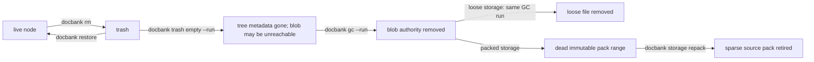

# Trash, GC, Repack & Verify

`docbank rm` is always a soft deletion. There is no `rm --hard`, and neither GC
nor repack runs automatically. Permanent deletion and physical reclamation are
separate operator decisions, so the window for regret is as wide as you want it
to be:



## Stage 1: Trash (`rm`, `restore`, `trash list`)

`docbank rm <path-or-id>` marks the node — and its whole subtree for directories
— as trashed. The tree entry disappears from `ls`, `tree`, and `search`; the
name becomes reusable; the bytes are untouched. Running GC after `rm` does
nothing to that content because trash remains a live, restorable reference.

```bash
docbank trash list
docbank trash list --json
```

```
SELECTOR   TRASHED AT                     NAME
id:15      2026-07-06T21:40:11.0021Z      return.pdf
id:88      2026-07-05T09:12:44.8810Z      old-drafts
```

Only trash *roots* are listed: trashing a directory produces one entry, and
`docbank restore id:<id>` brings the entire subtree back to its original
location. If a live node has since taken the name, the restored node is suffixed
(`return.pdf` → `return (2).pdf`); if the original parent was itself permanently
deleted, the node is restored under `/`.

Trashing a subtree stamps every node with the same trash time, so a nested
directory trashed *before* its parent keeps its own independent trash entry —
restoring the parent doesn't resurrect things you trashed separately.

`trash list --json` returns the roots under `items`. For maintenance automation,
`trash empty --json` returns `candidate_roots`, `deleted`, and `run`; it remains
a dry run unless `--run` is present.

## Stage 2: Empty the trash

```bash
docbank trash empty                        # dry run: everything
docbank trash empty --older-than 30d       # dry run: items trashed ≥30 days ago
docbank trash empty --older-than 30d --run # permanently delete those items
```

The command is a dry run unless `--run` is present. An executed run permanently
deletes the selected tree entries. The document bytes are still on disk and may
still be referenced by another node or version. Only content with no remaining
reference becomes a GC candidate.

## Stage 3: Garbage collection (`gc`)

Unreachable blob authority is removed only by explicit GC. A blob is *reachable*
— and therefore never collected — while any of these reference it:

- a live node,
- a trashed node (trash is always restorable in full), or
- a retained prior version of an edited document. Explicit, preview-first
  [version pruning](../architecture/editing-and-versions.md#choosing-retention)
  can release that reference without deleting the current file.

```bash
docbank gc          # dry run: candidate count and reclaimable bytes
docbank gc --run    # remove unreachable authority and loose files
```

For loose blobs, the reported reclaimable count is the physical number of raw
or zstd bytes that GC can unlink immediately; it is not the decoded document
size. A packed blob becomes logically dead when GC removes
its catalog authority, but its stored bytes remain in the immutable pack until
repack compacts that container; GC reports those bytes separately as pending
repack rather than claiming they were reclaimed.

`gc --run` runs behind the daemon's maintenance gate, so a concurrent import can
never dedup against a blob that's being deleted (see
[Ownership & Concurrency](../architecture/locking.md)). Files are removed before
their rows: a crash in between leaves rows-without-files, which the next
`gc --run` reconciles and `verify` flags in the meantime. Orphan blobs from
interrupted ingests are reclaimed the same way.

## Stage 4: Repack packed storage (`storage repack`)

GC cannot remove one range from an immutable pack file. After `gc --run`, dead
packed payload appears in `storage status` as `dead_packed_bytes`. An explicit
`docbank storage repack` rewrites eligible sparse packs with their live blobs
and retires the old source packs. Empty packs are retired directly.

Repack is not part of `rm`, `trash empty`, or `gc`, and there is currently no
background maintenance scheduler. This is intentional: repacking may rewrite
unrelated live blobs that share the same pack, so its timing and selection
thresholds remain an independent storage-policy decision.

## Embedded maintenance

Embedded applications own the same lifecycle but schedule finite passes instead
of asking the daemon to drain a full operation. `EmptyTrash` limits one preview
or deletion to `MaxRoots`; zero selects the finite `DefaultTrashEmptyMaxRoots`.
`GarbageCollect`, `Verify`, and `Repack` accept a `WorkBudget`; zero
`MaxObjects` selects the finite `DefaultMaintenanceMaxObjects`, while a positive
`MaxBytes` is a soft limit that lets the current object finish. `Pack` retains
its compatible soft `MaxBytes` option and reports `More` when eligible loose
backlog remains.

If a maintenance report returns `More`, schedule another pass. Reuse a non-empty
`NextCursor` only with the operation that issued it; cursors are opaque
continuation positions, not stable snapshots. Repack may return `More` with no
cursor while successful dead-pack retirement advances the work, in which case
another empty-cursor pass continues safely.

Embedded GC intentionally considers only bounded unreachable catalog rows; it
does not scan loose directories for untracked files. Embedded Verify re-hashes
only a bounded blob page and does not validate the whole metadata catalog. The
daemon commands above preserve full orphan reconciliation and whole-catalog
verification.

Physical maintenance never determines whether application data is live. Tree,
trash, version-retention, and any future external-reference policy decide which
logical references remain. GC only reclaims authority after those policies have
made a blob unreachable, and Repack only reclaims pack space made dead by GC.

## Verify

```bash
docbank verify
```

Validates logical metadata and audit history, then re-hashes every stored blob
against its recorded SHA-256. It reports `metadata` failures or `missing`,
`corrupt`, and `unreadable` problem blobs, exiting non-zero if anything is
wrong. Corruption is something you detect on your schedule, not something you
discover the day you need the document. Run it after moving the vault between
disks, before deleting original sources, and periodically from cron.

Next: protect what remains with [Backup & Restore](backup.md), and see
[Integrity & Trust](../architecture/integrity.md) for what `verify` defends
against.
