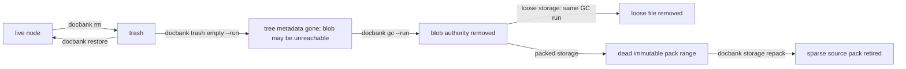

# Trash, GC, Repack & Verify

`docbank rm` moves documents to recoverable trash. To delete them permanently
and reclaim space, you must empty trash, run garbage collection (GC), and
repack eligible packed content. GC removes stored content with no remaining
references. Repack rewrites pack files to remove unused bytes.

There is no `rm --hard`. GC and repack do not run automatically:


```mermaid
flowchart LR
    A[live node] -- "docbank rm" --> B[trash]
    B -- "docbank restore" --> A
    B -- "docbank trash empty --run" --> C[tree metadata gone; blob may be unreachable]
    C -- "docbank gc --run" --> D[blob authority removed]
    D -- "loose storage: same GC run" --> E[loose file removed]
    D -- "packed storage" --> F[dead immutable pack range]
    F -- "docbank storage repack" --> G[sparse source pack retired]
```

## Stage 1: Trash (`rm`, `restore`, `trash list`)

`docbank rm <path-or-id>` marks the node — and its whole subtree for directories
— as trashed. The tree entry disappears from `ls`, `tree`, and `search`; the
name becomes reusable; the bytes are untouched. Running GC after `rm` does
nothing to that content because trash remains a live, restorable reference.

```bash
docbank trash list
docbank trash list --json
```

```
SELECTOR  TRASHED AT           NAME
id:15     2026-07-06T21:40:11Z  return.pdf
id:88     2026-07-05T09:12:44Z  old-drafts
```

Human output uses UTC second precision. `--json` retains the full authoritative
timestamps for automation.

Only trash *roots* are listed: trashing a directory produces one entry, and
`docbank restore id:<id>` brings the entire subtree back to its original
location. If a live node has since taken the name, the restored node is suffixed
(`return.pdf` → `return (2).pdf`); if the original parent was itself permanently
deleted, the node is restored under `/`.

Trashing a subtree stamps every node with the same trash time, so a nested
directory trashed *before* its parent keeps its own independent trash entry —
restoring the parent doesn't resurrect things you trashed separately.

`trash list --json` returns the roots under `items`. For maintenance automation,
`trash empty --json` returns `candidate_roots`, `deleted`, and `run`; it remains
a dry run unless `--run` is present.

## Stage 2: Empty the trash

```bash
docbank trash empty                        # dry run: everything
docbank trash empty --older-than 30d       # dry run: items trashed ≥30 days ago
docbank trash empty --older-than 30d --run # permanently delete those items
```

The command is a dry run unless `--run` is present. An executed run permanently
deletes the selected tree entries. The document bytes are still on disk and may
still be referenced by another node or version. Only content with no remaining
reference becomes a GC candidate.

## Stage 3: Garbage collection (`gc`)

GC removes a blob's catalog record only when nothing retains its content. A
blob remains *reachable*, and GC keeps it, while any of these reference it:

- a live node,
- a trashed node (trash is always restorable in full), or
- a retained prior version of an edited document.

Preview-first [version pruning](../architecture/editing-and-versions.md#choosing-retention)
can release a prior version's reference without deleting the current file.

```bash
docbank gc          # dry run: candidate count and reclaimable bytes
docbank gc --run    # remove unreachable authority and loose files
```

For loose blobs, the reported reclaimable count is the physical number of raw
or zstd bytes that GC can unlink immediately; it is not the decoded document
size. A packed blob becomes logically dead when GC removes
its catalog authority, but its stored bytes remain in the immutable pack until
repack compacts that container; GC reports those bytes separately as pending
repack rather than claiming they were reclaimed.

`gc --run` runs behind the daemon's maintenance gate, so a concurrent import can
never dedup against a blob that's being deleted (see
[Ownership & Concurrency](../architecture/locking.md)). Files are removed before
their rows: a crash in between leaves rows-without-files, which the next
`gc --run` reconciles and `verify` flags in the meantime. Orphan blobs from
interrupted ingests are reclaimed the same way.

## Stage 4: Repack packed storage (`storage repack`)

GC cannot remove one range from an immutable pack file. After `gc --run`, dead
packed payload appears in `storage status` as `dead_packed_bytes`. An explicit
`docbank storage repack` rewrites eligible sparse packs with their live blobs
and retires the old source packs. Empty packs are retired directly.

Run repack explicitly; `rm`, `trash empty`, and `gc` do not run it. There is no
automatic repack schedule. Repacking can rewrite live content that shares a
pack with unused bytes, so you choose its timing and selection thresholds.

## Embedded maintenance

Embedded applications own the same lifecycle but schedule finite passes instead
of asking the daemon to drain a full operation. `EmptyTrash` limits one preview
or deletion to `MaxRoots`; zero selects the finite `DefaultTrashEmptyMaxRoots`.
`GarbageCollect`, `Verify`, and `Repack` accept a `WorkBudget`; zero
`MaxObjects` selects the finite `DefaultMaintenanceMaxObjects`, and explicit
values are capped by `MaxMaintenanceObjects`. A positive `MaxBytes` is a soft
limit that lets the current object finish. `Pack` retains its compatible soft
`MaxBytes` option and reports `More` when eligible loose backlog remains.

If a maintenance report returns `More`, schedule another pass with its non-empty
`NextCursor`. Reuse a cursor only with the operation that issued it; cursors are
opaque continuation positions, not stable snapshots. Repack cursors retain the
mapping, dead-pack, or sparse-pack phase even when that phase has no blob-hash
position, so continuation does not restart completed mapping work.

Embedded GC intentionally considers only bounded unreachable catalog rows; it
does not scan loose directories for untracked files. Embedded Verify re-hashes
only a bounded blob page and does not validate the whole metadata catalog. The
daemon commands above preserve full orphan reconciliation and whole-catalog
verification.

Tree, trash, and version-retention rules decide which references remain. GC
reclaims content only after those references are gone. Repack then reclaims
pack space that GC made unused. The
[CLI Reference](../cli-reference.md) describes the full daemon maintenance
commands.

## Verify

```bash
docbank verify
```

Docbank validates metadata and audit history, then reads every stored blob
and checks its SHA-256 hash. It reports `metadata` failures or `missing`,
`corrupt`, and `unreadable` blobs. Any problem produces a non-zero exit status.
Run verification after moving the vault between disks, before deleting source
files, and periodically from a scheduler such as cron.

Next: protect what remains with [Backup & Restore](backup.md), and see
[Integrity & Trust](../architecture/integrity.md) for what `verify` defends
against.
