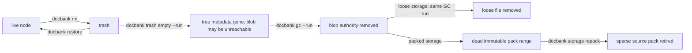

# Trash, garbage collection, repack, and verify

`docbank rm` moves documents to recoverable trash. To delete them permanently
and reclaim space, you must empty trash, run garbage collection (GC), and
repack eligible packed content. GC removes stored content with no remaining
references. Repack rewrites pack files to remove unused bytes.

There is no `rm --hard`. GC and repack do not run automatically:


```mermaid
flowchart LR
    A[live node] -- "docbank rm" --> B[trash]
    B -- "docbank restore" --> A
    B -- "docbank trash empty --run" --> C[tree metadata gone; blob may be unreachable]
    C -- "docbank gc --run" --> D[blob authority removed]
    D -- "loose storage: same GC run" --> E[loose file removed]
    D -- "packed storage" --> F[dead immutable pack range]
    F -- "docbank storage repack" --> G[sparse source pack retired]
```

## Stage 1: Trash (`rm`, `restore`, `trash list`)

`docbank rm <path-or-id>` marks the node, and for a directory its whole
subtree, as trashed. The tree entry disappears from `ls`, `tree`, and `search`,
the name becomes reusable, and the bytes are untouched. Running GC after `rm`
does nothing to that content because trash remains a live, restorable
reference.

```bash
docbank trash list
docbank trash list --json
```

```
SELECTOR  TRASHED AT           NAME
id:15     2026-07-06T21:40:11Z  return.pdf
id:88     2026-07-05T09:12:44Z  old-drafts
```

Human output uses UTC second precision. `--json` keeps the full timestamps for
automation.

Only trash *roots* are listed. Trashing a directory produces one entry, and
`docbank restore id:<id>` brings the entire subtree back to its original
location. If a live node has since taken the name, the restored node gets a
suffix (`return.pdf` → `return (2).pdf`). If the original parent was itself
permanently deleted, the node is restored under `/`.

Trashing a subtree stamps every node with the same trash time, so a nested
directory trashed *before* its parent keeps its own trash entry. Restoring the
parent leaves separately trashed items in trash unless photo-group recovery includes them.

Photos' **Move to trash** action and `docbank photos assets trash <asset-id>` move all asset members together with an asset revision check. The browser trash drawer and paginated TUI list group independently trashed photo members into one row. The CLI's unpaged list keeps its ordinary node listing. Restoring any photo member restores its whole group, including companions in other folders. If that member belongs to a trashed folder, restore also recovers the folder's original subtree.

Recovery follows companions transitively. A recovered folder brings back the companions of every photo inside it, and any trashed folder holding one of those companions returns with all its contents. One restore can therefore recover several folders. The restore response and `docbank restore` report only the selected node; list the trash afterward to see what remains.

`trash list --json` returns the roots under `items`. For maintenance
automation, `trash empty --json` returns `candidate_roots`, `retained_roots`,
`held_roots`, `deleted`, and `run`. It remains a dry run unless `--run` is present.

## Stage 2: Empty the trash

```bash
docbank trash empty                        # dry run: everything
docbank trash empty --older-than 30d       # dry run: items trashed ≥30 days ago
docbank trash empty --older-than 30d --run # permanently delete those items
```

The command is a dry run unless `--run` is present. An executed run permanently
deletes the selected tree entries. The document bytes are still on disk and may
still be referenced by another node or version. Only content with no remaining
reference becomes a GC candidate.

Trash previews and deletion serialize with mutations through the maintenance gate. Large photo cleanups keep other writes waiting or returning busy for longer, including during a dry run.

Photo groups are deleted together. A live, too-new, or retained member protects every connected trash root, including folders containing members. Trash the remaining members with `docbank photos assets trash <asset-id>`, or detach live companions, to make a partial group eligible. The report's `held_roots` counts eligible roots kept this way, and `docbank trash empty` prints a `held` line when it is nonzero. Bounded maintenance finishes a complete group even when it exceeds the root budget; the dry run reports that expanded group, and `More` reports another eligible group. Photo and album relationships remain recoverable until permanent deletion; file bytes stay in place throughout trash and restore.

### Release email attachment references

Mailbox imports and explicit EML transfers keep their messages and attachment
versions for retry receipts. Emptying trash skips those nodes and any
containing folder, so they do not block deletion of unrelated trash. Their
receipts cannot be released. See
[Mailbox archives](importing.md#mailbox-archives).

Published email attachments keep their source and child versions. If a receipt
blocks permanent deletion or version pruning, the error names its operation ID.
Inspect that receipt before releasing its references:

```bash
docbank email-documents show <operation-id>
docbank email-documents relations --parent-version <version-id>
docbank email-documents release <operation-id> --request-digest <request-digest>
```

`show` and `relations` return JSON. Copy `request_digest` from the inspected
receipt into the release command. Release removes the receipt and its links,
keeps ordinary child documents, and relinquishes the original operation's retry
guarantee. Repeat the deletion command after releasing all blocking receipts.
Other retention rules still apply.

Use `--child-version` to inspect a child's incoming relationships. See the
[CLI reference](../cli-reference.md#docbank-email-documents) for page controls
and the [embedding guide](../embedding.md#publish-email-attachment-documents)
for publication and retention rules.

## Stage 3: Garbage collection (`gc`)

GC removes a blob's catalog record only when nothing retains its content. A
blob remains *reachable*, and GC keeps it, while any of these reference it:

- a live node,
- a trashed node (trash is always restorable in full), or
- a retained prior version of an edited document.

Preview-first [version pruning](../architecture/editing-and-versions.md#choosing-retention)
can release a prior version's reference without deleting the current file.

```bash
docbank gc          # dry run: candidate count and reclaimable bytes
docbank gc --run    # remove unreachable authority and loose files
```

For loose blobs, the reported reclaimable count is the physical number of raw
or zstd bytes that GC can unlink immediately. It is not the decoded document
size. A packed blob becomes logically dead when GC removes its catalog record,
but its stored bytes remain in the immutable pack until repack compacts that
container. GC reports those bytes separately as pending repack.

`gc --run` runs behind the daemon's maintenance gate, so a concurrent import
cannot deduplicate against a blob that is being deleted (see
[Ownership and concurrency](../architecture/locking.md)). Files are removed
before their rows. A crash in between leaves rows without files, which the next
`gc --run` reconciles and `verify` flags in the meantime. Orphan blobs from
interrupted ingests are reclaimed the same way.

## Stage 4: Repack packed storage (`storage repack`)

GC cannot remove one range from an immutable pack file. After `gc --run`, dead
packed payload appears in `storage status` as `dead_packed_bytes`.
`docbank storage repack` rewrites eligible sparse packs with their live blobs
and retires the old source packs. Empty packs are retired directly.

You must run repack yourself. `rm`, `trash empty`, and `gc` do not run it, and
there is no automatic repack schedule. Repacking can rewrite live content that
shares a pack with unused bytes, so you choose its timing and selection
thresholds.

## Embedded maintenance

Embedded applications own the same lifecycle but schedule finite passes instead
of asking the daemon to drain a full operation. `EmptyTrash` uses `MaxRoots` as a batch target and finishes complete photo groups even when they exceed it. Zero selects `DefaultTrashEmptyMaxRoots`.
`GarbageCollect`, `Verify`, and `Repack` accept a `WorkBudget`. Zero
`MaxObjects` selects the finite `DefaultMaintenanceMaxObjects`, and explicit
values are capped by `MaxMaintenanceObjects`. A positive `MaxBytes` is a soft
limit that lets the current object finish. `Pack` keeps its compatible soft
`MaxBytes` option and reports `More` when eligible loose backlog remains.

If a maintenance report returns `More`, schedule another pass with its
non-empty `NextCursor`. Reuse a cursor only with the operation that issued it.
Cursors are opaque continuation positions, not stable snapshots. Repack cursors
keep the mapping, dead-pack, or sparse-pack phase even when that phase has no
blob-hash position, so continuation does not restart completed mapping work.

Embedded GC considers only a bounded set of unreachable catalog rows. It does
not scan loose directories for untracked files. Embedded Verify re-hashes only
a bounded blob page and does not validate the whole metadata catalog. The
daemon commands above still perform full orphan reconciliation and
whole-catalog verification.

Tree, trash, and version-retention rules decide which references remain. GC
reclaims content only after those references are gone. Repack then reclaims
pack space that GC made unused. The [CLI reference](../cli-reference.md)
describes the full daemon maintenance commands.

## Verify

```bash
docbank verify
```

Docbank validates metadata and audit history, then reads every stored blob
and checks its SHA-256 hash. It reports `metadata` failures or `missing`,
`corrupt`, and `unreadable` blobs. Any problem produces a non-zero exit status.
Run verification after moving the vault between disks, before deleting source
files, and periodically from a scheduler such as cron.

Next: protect what remains with [Backup and restore](backup.md), and see
[Integrity and trust](../architecture/integrity.md) for what `verify` defends
against.
